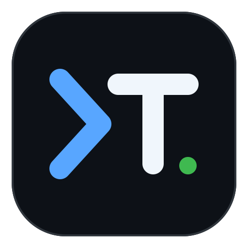

<p align="center">
  
</p>

# Termior

[English](README.md#english) · [简体中文](README.md#简体中文) · [繁體中文](README.zh-TW.md) · [日本語](README.ja.md) · [한국어](README.ko.md) · Español · [Deutsch](README.de.md)

---

## Español

> Un entorno de desarrollo nativo de IA (ADE), de código abierto, multiplataforma y con el terminal como prioridad. BYOK, prioridad por lo local, sin cuenta y sin telemetría.

Termior reúne en una sola ventana nativa un terminal PTY real, un editor de código ligero, un explorador de archivos, Git, una vista previa web y un agente integrado/externo con llamadas a herramientas, aprobaciones, revisión de cambios y recuperación. La especificación autoritativa de producto e ingeniería está en [docs/termior-spec.md](docs/termior-spec.md) (en inglés).

### Valores fundamentales

1. **Latencia nativa baja** — La interfaz principal no tiene runtime de JS ni frontera de serialización por IPC. El terminal y el editor se renderizan directamente en la GPU, con objetivo de 60 fps en estado estable y 120 fps en pantallas de alta frecuencia.
2. **Colaboración profunda terminal–IA** — Un PTY real, el contexto vivo de cwd/búfer, las llamadas a herramientas, las aprobaciones y la revisión de diffs a nivel de hunk conviven en el mismo espacio de trabajo.
3. **Prioridad por lo local y control del usuario** — BYOK, las claves solo se guardan en el llavero del sistema operativo, sin telemetría, sin cuenta, y soporte de servidores de inferencia locales como LM Studio, MLX y Ollama.
4. **Límites de seguridad explícitos** — Cada operación de disco, shell, secretos o red realizada por el agente integrado pasa por la autorización del workspace, las aprobaciones, la deny-list y las puertas de política SSRF. Los agentes externos deben mostrar su backend, entorno de ejecución, capacidades reales de aislamiento e incógnitas, en lugar de hacer pasar sus propias operaciones como cubiertas por las puertas integradas.

### Hito de escritorio actual

El workspace ha pasado de un prototipo de lógica pura a un banco de trabajo de escritorio compilable con GPUI. Actualmente incluye:

- Workspaces persistentes, 8 tipos de pestañas, paneles divididos, barras laterales Explorer / Source Control / History, barra de estado y una ventana de ajustes independiente;
- Un terminal real sobre portable-pty y alacritty_terminal: integración de shell (bash/zsh/fish/PowerShell), OSC 7/133/777, IME, búsqueda, historial de desplazamiento, detección de URL y localhost, y Job Objects de Windows; selector de shell predeterminado en ajustes (predeterminado del sistema / shells detectados, incluidos Git Bash y distribuciones WSL / ruta manual) más un menú opcional de elección de shell al crear un terminal; menú contextual de copiar/pegar/seleccionar todo;
- [Sesiones SSH y SFTP](docs/ssh.md) (en inglés): perfiles de conexión con conexión rápida desde la barra lateral, almacén de credenciales del sistema, autenticación por contraseña/MFA/clave/agente, hosts de salto, verificación de huellas de host y transferencia de archivos/directorios con reanudación; un navegador SFTP de dos paneles y un explorador de archivos que sigue la pestaña remota activa;
- Búferes de edición con Rope, viewport virtualizado, resaltado incremental con tree-sitter, búsqueda, deshacer/rehacer, texto fantasma de autocompletado en línea, 10 temas del editor y una capa de interacción Vim;
- Indexación de archivos con indexación superficial y vigilancia con debounce, conciencia de gitignore, búsqueda difusa, grep en segundo plano por streaming, navegación de árbol por teclado y menús contextuales completos; carpetas de proyecto por pestaña con inyección de `cd` y seguimiento de la barra lateral;
- Pestañas dedicadas de diff / historial / archivo de commit de Git, stage/unstage a nivel de archivo y hunk, descarte confirmado, commit, branch, fetch/pull/push y un grafo de commits, con la actualización de estado fuera del hilo de UI;
- Vista previa web: detección de URL de localhost, validación de URL y traspaso al navegador del sistema (sin WebView embebido — ver [ADR 0002](docs/adr/0002-remove-embedded-webview.md), en inglés); una vista previa nativa de Markdown sincronizada con el búfer de edición compartido;
- 12 temas de la aplicación con un modelo de temas personalizado, además de un fondo de ventana con desenfoque renderizado por GPU;
- Adaptadores HTTP/SSE reales para OpenAI, Anthropic, Gemini, Groq, xAI, Cerebras, OpenRouter, DeepSeek, Mistral, compatible con OpenAI, LM Studio, MLX y Ollama;
- Llavero del sistema, memoria de sesión/proyecto, adjuntos de archivo/imagen/portapapeles/`@path`, snippets/TODO y los modos de envío Auto / Plan / Yolo;
- Una superficie de comandos del Composer: una paleta de comandos slash `/` (nueva sesión, Auto/Plan/Yolo, cambio de agente, detener, adjuntar, paneles acoplables e inspector) que reutiliza el mapa de teclas en lugar de bifurcar el comportamiento; autocompletado de snippets `#handle` respaldado por `/snippet` y `/snippets`; y un panel `/todos` sobre una lista de TODO local de la aplicación compartida con el agente mediante `todo_read` / `todo_write`;
- Las selecciones del terminal se adjuntan al Composer con procedencia del comando: los límites C/D de OSC 133 se alinean con los bytes exactos de cada comando, de modo que un adjunto lleva el id del comando, el cwd, la línea de comando y el código de salida, y un elemento del menú contextual adjunta la salida del último comando fallido;
- Task/Turn serializables, presupuestos y cancelación, ejecución real de herramientas, tarjetas de aprobación, tiempos de espera de comandos, shells persistentes, procesos en segundo plano y el circuito de seguridad `write_file → AI diff → decisión por hunk → escritura atómica`;
- Un agente integrado y el app-server de Codex, intercambiables dentro del Composer; el `termior-agent-host` independiente proporciona el contrato estructurado de backend, los adaptadores Codex/ACP, la negociación de capacidades y la descripción del entorno de ejecución;
- Reglas por capas de `AGENTS.md`, un Context Inspector, Agent Skills, MCP sobre stdio y Streamable HTTP, Hooks acotados, Memory revisable, agentes personalizados y orquestación de subtareas;
- recuperación por journal/snapshot, un Recovery Center, checkpoints direccionados por contenido, entornos de ejecución direct/worktree/sandboxed y puntos de entrada para el árbol de tareas y la cola de automatización;
- Enrutado unificado de notificaciones para agentes integrados y de terminal: suprimidas cuando el destino es visible, toast temático cuando está oculto, notificación del sistema cuando la ventana pierde el foco, con la campana del encabezado listando los estados actuales;
- Instalación y desinstalación seguras e idempotentes de los hooks OSC de Claude Code.

Sigue siendo un hito por etapas, no la aceptación final de toda la especificación. El alcance base de escritorio está documentado en [docs/desktop-milestone.md](docs/desktop-milestone.md) (en inglés); la evidencia de implementación de las etapas A–E del agente, junto con el sandboxing por plataforma, OAuth para MCP remoto, un cliente ACP real y los límites de ejecución de automatización en segundo plano, está en [docs/ai-agent-implementation-status.md](docs/ai-agent-implementation-status.md) (en inglés).

La última versión etiquetada es `v0.2.1`; la versión del workspace vive en [Cargo.toml](Cargo.toml).

### Workspace

```text
crates/
  termior                  punto de entrada GPUI, arranque de la app y cableado de escritorio
  termior-ui               capa de vistas GPUI, estado persistente de tabs/sidebar/workspace
  termior-ui-kit           controles compartidos, layout de paneles y modelos de búsqueda
  termior-i18n             tablas de traducción embebidas en compilación y fallback de locale
  termior-terminal         sesiones PTY, ciclo de vida de procesos y puente de bytes
  termior-ssh              perfiles de conexión OpenSSH, opciones de auth y comandos SFTP
  termior-terminal-core    OSC, integración de shell, búsqueda
  termior-editor           Rope, tree-sitter, Vim, estado de autocompletado
  termior-explorer         índice de archivos, árbol, búsqueda, vigilancia
  termior-explorer-core    lógica pura de coincidencia difusa y globs
  termior-vcs              estado de Git, diff, historial y operaciones remotas
  termior-preview          detección de localhost y estado de vista previa
  termior-ai               providers, runtime de tareas, herramientas, contexto y orquestación
  termior-agent-host       contrato de backend de agente integrado/externo, Codex, ACP, MCP
  termior-diff             diff por hunks y aplicación de conjuntos aceptados
  termior-security         autorización, deny-list, SSRF, puertas de herramientas
  termior-store            JSON atómico, migraciones, ajustes, journal de tareas, checkpoints
  termior-theme            paleta semántica central y biblioteca de temas
  termior-hooks            hooks de Claude Code
  termior-platform         notificaciones del sistema, URLs externas y frontera de auto-actualización
  termior-bench            arranque en frío, memoria, fps y puertas de rendimiento PTY
```

### Compilación y verificación

Se necesita Rust stable, la cadena de herramientas nativa de la plataforma y las dependencias de sistema de GPUI.

#### Windows: activa primero el entorno MSVC

El proyecto compila código C de `libgit2-sys`, `libz-sys` y otros, por lo que `cl.exe` debe poder encontrar los encabezados de la biblioteca estándar de C (por ejemplo `time.h`). Ejecutar `cargo build` directamente desde Git Bash o un terminal plano deja `INCLUDE`, `LIB` y `VCINSTALLDIR` sin definir, y `cl.exe` falla con `fatal error C1083: Cannot open include file: 'time.h'` (visible en los logs de cc-rs como `command did not execute successfully (status code: exit code: 2)`). Activa el entorno MSVC antes de compilar.

Elige una de estas opciones para que `INCLUDE` / `LIB` / `VCINSTALLDIR` dejen de estar vacías:

- **x64 Native Tools Command Prompt for VS 2022** (lo más sencillo): ábrelo desde el menú Inicio — las variables ya están definidas — y ejecuta los comandos de abajo.
- **PowerShell / cmd**: ejecuta primero `vcvars64.bat` y luego compila:
  ```bat
  "C:\Program Files\Microsoft Visual Studio\2022\Community\VC\Auxiliary\Build\vcvars64.bat"
  cargo build
  ```
- **Git Bash**: envuelve la llamada en cmd para que el `.bat` corra bajo el intérprete correcto:
  ```bash
  cmd //c '"C:\Program Files\Microsoft Visual Studio\2022\Community\VC\Auxiliary\Build\vcvars64.bat" && cargo build'
  ```

Verifica el entorno:

```bat
echo %INCLUDE%   &  rem debe apuntar a los encabezados de MSVC y a los directorios ucrt/shared/um del SDK de Windows
echo %LIB%       &  rem debe apuntar a los directorios de bibliotecas correspondientes
echo %VCINSTALLDIR%
```

#### Verificación

Estos comandos coinciden con la división core/escritorio usada en CI:

```bash
cargo fmt --all -- --check
cargo clippy --workspace --all-targets --exclude termior -- -D warnings
cargo test --workspace --exclude termior --all-targets
cargo test -p termior-ui-kit --no-default-features
cargo check -p termior
cargo clippy -p termior --all-targets -- -D warnings
cargo test -p termior --all-targets
cargo build -p termior --release
cargo llvm-cov --workspace --exclude termior --tests --fail-under-lines 80
cargo bench -p termior-editor --bench large_file -- --quick
cargo bench -p termior-bench --bench pty_throughput -- --quick
```

CI implementa la misma división: `ci.yml` ejecuta una comprobación de generación de iconos, el job core en las tres plataformas, el job desktop (check, clippy, tests, build de release, puerta de tamaño del binario, frames de humo en Windows, humo de panel dividido, puerta de proceso NFR), un job de cobertura con umbral del 80% de líneas y un job de benchmarks con puerta de rendimiento PTY. `audit.yml` ejecuta `cargo-deny` en cada push y semanalmente para detectar derivas de licencias y CVEs.

#### Iconos de la aplicación

`assets/termior-logo.svg` es la única fuente de verdad de los iconos de la aplicación. Tras editar el SVG, regenera el ICO de Windows, el ICNS de macOS, los PNG genéricos y los recursos hicolor de Linux con Node.js 22+:

```bash
npm ci
npm run icons
npm run icons:check
```

#### Ejecutar la aplicación de escritorio

```bash
cargo run -p termior
```

#### Publicación

Una etiqueta de release (`v<versión-del-workspace>`) dispara una build de release en tres plataformas que produce archivos ZIP/TAR portables con checksums SHA-256 además de instaladores por plataforma: un `*-setup.exe` de Inno Setup en Windows, un `.dmg` de arrastrar-para-instalar en macOS y un `.deb` generado con `cargo-deb` en Linux. El pipeline aplica los límites de 60 MiB por binario y 100 MiB por archivo/instalador de la Spec NFR-05. Localmente puedes reproducir la comprobación y el empaquetado con `scripts/check-release-binary.ps1` y `scripts/package-release.ps1` (el instalador de Windows requiere Inno Setup 6 en la máquina).

El tamaño de la release proviene sobre todo de la pila de renderizado nativa de GPUI, la capa de terminal/VTE, las gramáticas de tree-sitter por lenguaje y los clientes de TLS, llavero y providers. La vista previa web se traspasa al navegador del sistema en lugar de embeber un WebView (ADR 0002), lo que mantiene la superficie de dependencias idéntica entre plataformas; la decodificación PNG y los lenguajes de tree-sitter usan features mínimas explícitas, de modo que las nuevas capacidades de UI, vista previa o gramáticas deben evaluarse contra los informes de árbol de dependencias y tamaño de CI.

Los endpoints, modelos y habilitación de providers viven en `Termior-settings.json`; las claves de API se escriben solo a través de la ventana de ajustes en el llavero del sistema y nunca se serializan en los archivos de ajustes o de sesión.

#### Actualización automática

**Ajustes → About** ofrece un interruptor de actualización automática (activado por defecto), una comprobación manual y las notas de la versión. La app comprueba las releases estables de GitHub 15 segundos tras el arranque y cada 6 horas después, descarga el instalador que coincide con el sistema operativo y la arquitectura de CPU y verifica su SHA-256. Al completarse la descarga, la barra de título muestra **Update available**; abre About y elige **Install update…** para lanzar el instalador del sistema. Finaliza o detén las tareas del terminal antes de cerrar la app para completar la instalación — el actualizador nunca cierra por sí solo la app ni sus terminales. Con la actualización automática desactivada, las comprobaciones manuales siguen funcionando.

Windows usa Inno Setup, macOS abre un DMG para reemplazar la app por arrastre y Linux usa el instalador DEB. Para builds portables, distribuciones sin soporte DEB o arquitecturas sin paquete, actualiza manualmente desde la página de descargas de la release. Los fallos de red o checksum muestran un error y conservan la versión actual; los archivos entregados al instalador del sistema permanecen en el directorio temporal y pueden borrarse tras la instalación. Los checksums solo verifican la integridad del archivo — los instaladores actuales de Windows y macOS aún no están firmados.

### Privacidad y seguridad

- Sin telemetría, sin cuenta, sin subidas automáticas;
- Los providers locales pueden usarse totalmente sin conexión;
- Las rutas sensibles como `.env`, `.ssh` y credentials se rechazan en ambas direcciones tras la canonización;
- El tráfico hacia providers en la nube pasa siempre por las comprobaciones SSRF de URL e IP tras la resolución;
- Las escrituras de archivos nunca llegan a disco directamente desde el modelo — deben pasar la aprobación de herramientas y la revisión por hunks.

### Internacionalización (i18n)

La interfaz se distribuye en siete idiomas: English, 简体中文, 繁體中文, 日本語, 한국어, Español y Deutsch. **Ajustes → General → Language** cambia al instante (la ventana principal sigue al guardado con debounce); el valor predeterminado **Seguir el sistema** respeta el locale del sistema operativo. Las traducciones son tablas JSON planas embebidas en compilación en `crates/termior-i18n/locales/` — `en.json` es la fuente de verdad, cada locale debe mantener un conjunto de claves idéntico, y un test de CI impone la paridad y valores no vacíos. El diseño está en el [ADR 0007](docs/adr/0007-i18n-embedded-json-tables.md) (en inglés).

### Licencia

El proyecto en sí está bajo la [MIT License](LICENSE). Las licencias de dependencias de terceros se auditan con `cargo deny --exclude termior check`; [LICENSE-APACHE](LICENSE-APACHE) existe únicamente para preservar los términos Apache-2.0 del upstream del `gpui_windows` vendored, y el árbol de dependencias upstream de GPUI se verifica por separado.
