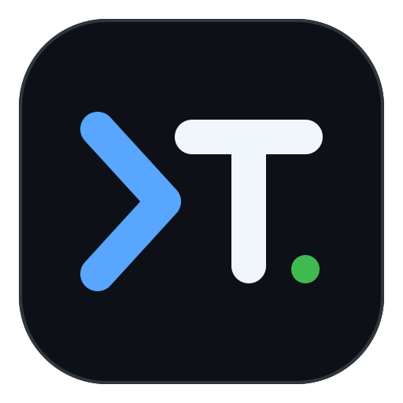

<p align="center">
  
</p>

# Termior

> 开源、跨平台、终端优先的 AI 原生开发工作台（ADE）。BYOK、本地优先、无账号、无遥测。

Termior 在单一原生窗口中组合真 PTY 终端、轻量代码编辑器、文件浏览器、Git、Web 预览，以及具有工具调用、审批和 AI diff 审阅能力的 Agent。产品与工程规格见 [docs/termior-spec.md](docs/termior-spec.md)。

## 核心价值

1. **原生低延迟**：核心 UI 无 JS 运行时与 IPC 序列化边界，终端和编辑器直接使用原生 GPU 渲染，常态目标 60 fps，高刷屏目标 120 fps。
2. **终端与 AI 深度协同**：真 PTY、实时 cwd/缓冲上下文、工具调用、审批与 hunk 级 diff 审阅集中在同一工作区。
3. **本地优先与用户掌控**：BYOK、密钥只进系统钥匙串、无遥测、无账号，并支持 LM Studio、MLX、Ollama 等本地推理服务。
4. **明确的安全边界**：所有触盘、触 shell、触密钥和触网操作统一经过 workspace 授权、审批、deny-list 与 SSRF 策略门控。

## 当前桌面里程碑

当前分支已经从纯逻辑原型推进到可编译的 GPUI 桌面工作台，主要包含：

- 持久化工作区、8 类 tab、分栏、Explorer/Source Control/History 侧栏、状态栏、独立设置窗口；
- portable-pty + alacritty_terminal 真终端，shell integration、OSC 7/133/777、IME、搜索、回滚滚动、URL/localhost 检测和 Windows Job Object；
- Rope 编辑缓冲、虚拟可视区、tree-sitter 增量高亮、搜索、撤销重做、10 套独立编辑器主题和 Vim 交互层；
- 文件索引、gitignore、模糊查找、后台流式 grep、文件监听、键盘树导航与完整上下文菜单；
- Git 专用 diff/history/commit-file 页签、文件/hunk stage/unstage、确认 discard、commit、branch、fetch/pull/push 与 commit graph；
- Web 预览：localhost URL 检测 + URL 校验 + 系统浏览器打开（不内嵌 WebView，见 [ADR 0002](docs/adr/0002-remove-embedded-webview.md)）；
- 10 套应用主题、自定义主题模型和全窗背景配置；
- OpenAI、Anthropic、Gemini、Groq、xAI、Cerebras、OpenRouter、DeepSeek、Mistral、OpenAI-compatible、LM Studio、MLX、Ollama 的真实 HTTP/SSE 适配；
- OS 钥匙串、会话/项目记忆、文件/图片/剪贴板/`@path` 附件、snippets/TODO、Plan mode、子代理、自定义代理；
- 真实 Agent 工具执行、审批卡片、命令超时、持久 shell、后台进程，以及 `write_file → AI diff → 逐 hunk 决策 → 原子写` 安全闭环；
- 内置/终端 Agent 统一通知路由：可见时抑制、隐藏时主题 toast、窗口失焦时系统通知，并在 header 铃铛列出当前状态；
- Claude Code OSC hooks 的安全、幂等安装与卸载。

这仍是阶段性里程碑，不等于整份 spec 已最终验收。尚待继续完善的交互和非功能项记录在 [docs/desktop-milestone.md](docs/desktop-milestone.md)。

## Workspace

```text
crates/
  termior                  GPUI 桌面应用与视图接线
  termior-ui               tab/sidebar/workspace 持久状态
  termior-ui-kit           pane 布局与共享搜索模型
  termior-terminal         PTY 会话、进程生命周期和字节桥
  termior-terminal-core    OSC、shell integration、搜索
  termior-editor           Rope、tree-sitter、Vim、补全状态
  termior-explorer         文件索引、树、搜索、watcher
  termior-explorer-core    模糊匹配与 glob 纯逻辑
  termior-vcs              Git 状态、diff、历史和远端操作
  termior-preview          localhost 检测与预览状态
  termior-ai               Provider、Agent、工具、会话和 Composer
  termior-diff             hunk diff 与接受集应用
  termior-security         授权、deny-list、SSRF、工具门控
  termior-store            原子 JSON、迁移、设置、键位
  termior-theme            中央语义色板与主题库
  termior-hooks            Claude Code hooks
  termior-platform         系统通知与外部 URL 边界
```

## 构建与验证

需要 stable Rust、平台原生编译工具，以及 GPUI 对应的系统依赖。

### Windows：先加载 MSVC 开发环境

项目编译 `libgit2-sys`、`libz-sys` 等 C 代码，依赖 `cl.exe` 能找到 C 标准库头文件（如 `time.h`）。
在 Git Bash / 普通终端中直接运行 `cargo build` 时，`INCLUDE`、`LIB`、`VCINSTALLDIR` 等变量为空，
`cl.exe` 会报 `fatal error C1083: Cannot open include file: 'time.h'`（cc-rs 日志里表现为
`command did not execute successfully (status code exit code: 2)`）。因此构建前需先激活 MSVC 环境。

任选一种方式，使 `INCLUDE` / `LIB` / `VCINSTALLDIR` 不再为空：

- **x64 Native Tools Command Prompt for VS 2022**（最简单）：从开始菜单打开，其中已内置上述变量，直接执行下方命令即可。
- **PowerShell / cmd**：先运行 `vcvars64.bat` 再编译：
  ```bat
  "C:\Program Files\Microsoft Visual Studio\2022\Community\VC\Auxiliary\Build\vcvars64.bat"
  cargo build
  ```
- **Git Bash**：用 cmd 包一层，确保 `.bat` 在正确的解释器里执行：
  ```bash
  cmd //c '"C:\Program Files\Microsoft Visual Studio\2022\Community\VC\Auxiliary\Build\vcvars64.bat" && cargo build'
  ```

验证环境是否就绪：

```bat
echo %INCLUDE%   &  rem 应指向 MSVC 头文件与 Windows SDK 的 ucrt/shared/um 目录
echo %LIB%       &  rem 应指向对应的库目录
echo %VCINSTALLDIR%
```

### 验证

```bash
cargo fmt --all -- --check
cargo clippy --workspace --all-targets -- -D warnings
cargo test --workspace --all-targets
cargo build --workspace --release
cargo llvm-cov --workspace --exclude termior --tests --fail-under-lines 80
cargo bench -p termior-editor --bench large_file -- --quick
```

应用图标以 `assets/termior-logo.svg` 为唯一源文件。修改 SVG 后，使用 Node.js 22+
重新生成 Windows ICO、macOS ICNS、通用 PNG 与 Linux hicolor 资源：

```bash
npm ci
npm run icons
npm run icons:check
```

运行桌面应用：

```bash
cargo run -p termior
```

发布 tag（`v<workspace-version>`）会触发三平台 release 构建，产出 portable ZIP/TAR 与 SHA-256 校验文件。流水线按 Spec NFR-05 将单二进制限制为 60 MiB，并将压缩包限制为 100 MiB；本地可用 `scripts/check-release-binary.ps1` 和 `scripts/package-release.ps1` 复现检查与打包。

Release 体积主要来自 GPUI 原生渲染栈、终端/VTE、按语言引入的 tree-sitter grammar，以及 TLS、钥匙串和 Provider 客户端。Web 预览统一交系统浏览器打开、不内嵌 WebView（ADR 0002），三平台依赖面一致；PNG 解码和 tree-sitter 语言均采用显式最小 feature，新增 UI、预览或语法能力时须结合 CI 的依赖树和体积报告评估增量。

Provider 的 endpoint、模型和启用状态保存在 `Termior-settings.json`；API key 只通过设置窗口写入 OS 钥匙串，绝不会序列化进设置或会话文件。

## 隐私与安全

- 无遥测、无账号、无自动上传；
- 本地 Provider 可离线使用；
- `.env`、`.ssh`、credentials 等敏感路径在 canonicalize 后双向拒绝；
- 云 Provider 出网统一经过 URL 和解析后 IP 的 SSRF 检查；
- 写文件不会由模型直接落盘，必须经过工具审批和 hunk 审阅。

## 许可

Apache License 2.0。第三方依赖许可由 `cargo deny --exclude termior check` 审计；
GPUI 上游依赖树另行核验。
